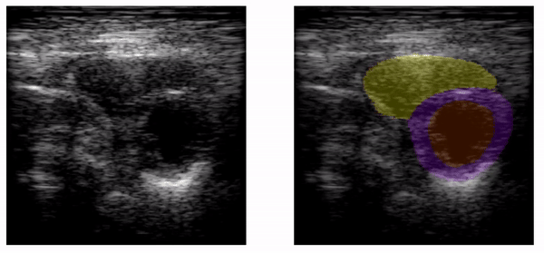
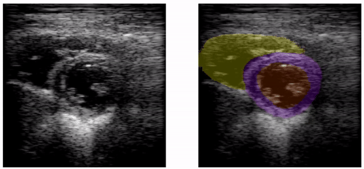

# SOTA-DL-EchoSegmentation
Evaluation of state-of-the-art (SOTA) deep learning (DL) models in the segmentation of left and right ventricles in parasternal short-axis echocardiograms (PSAX-echo)
- SIUE Biomedical Imaging Research Lab - BIRL
..:: https://siue-biomedicalimaginglab.com/ ::..

A deep learning based approach to segment medical echocardiography PSAX images into its 3 main heart structures:
* Left ventricle (LV)
* Left myocardium (LM)
* Right ventricle (RV)

This repo contains Sample testing data from the Journal paper:

### Evaluation of state-of-the-art deep learning models in the segmentation of the left and right ventricles in parasternal short-axis echocardiograms

#### Purpose
Previous studies on echocardiogram segmentation are focused on the left ventricle in parasternal long-axis views. Deep-learning models were evaluated on the segmentation of the ventricles in parasternal short-axis echocardiograms (PSAX-echo). Segmentation of the ventricles in complementary echocardiogram views will allow the computation of important metrics with the potential to aid in diagnosing cardio-pulmonary diseases and other cardiomyopathies. Evaluating state-of-the-art models with small datasets can reveal if they improve performance on limited data.

#### Approach
PSAX-echo was performed on 33 volunteer women. An experienced cardiologist identified end-diastole and end-systole frames from 387 scans, and expert observers manually traced the contours of the cardiac structures. Traced frames were pre-processed and used to create labels to train two domain-specific (Unet-Resnet101 and Unet-ResNet50), and four general-domain [three segment anything (SAM) variants, and the Detectron2] deep-learning models. The performance of the models was evaluated using the Dice similarity coefficient (DSC), Hausdorff distance (HD), and difference in cross-sectional area (DCSA).
### Cite as:
Julian R. Cuellar, Vu Dinh, Manjula Burri, Julie Roelandts, James Wendling, Jon D. Klingensmith, "Evaluation of state-of-the-art deep learning models in the segmentation of the left and right ventricles in parasternal short-axis echocardiograms," J. Med. Imag. 12(2) 024002 (26 March 2025) https://doi.org/10.1117/1.JMI.12.2.024002

## Dependencies

This Python file was tested on:
- Python 3.7
- ImageIO 2.9.0
- imageio-ffmpeg 0.5.1
- Keras 2.3.1
- MatPlotLib 3.3.2
- NumPy 1.19.2
- SciKit-Image 0.17.2

## How to run
1. Create a system environment using **_Anaconda 3_**.
2. Create a `Fork` from this repository to your GitHub.
3. `Clone` the repo with your IDE - we use the PyCharm tools in our Lab.
### UnetResNet Model

4. Download a trained model weights from [OneDrive/Training_Models](https://siuecougars.sharepoint.com/:f:/r/sites/cardiacfatsegmentation/Shared%20Documents/Training_Models/2D-Echo-PSAX-Segmentation?csf=1&web=1&e=689kmf) to the folder `model/` in the local directory.
5. Select the IQ file that you want to segment and create a video. IQ files are in [OneDrive/UltrasoundData](https://siuecougars.sharepoint.com/:f:/r/sites/cardiacfatsegmentation/Shared%20Documents/UltrasoundData?csf=1&web=1&e=mpW4Zo).
6. Run the Python script
```
TrainTestRESNET.py
```
5. Segmented images are saved in `Data/SegmentOutput/RESNET/` folder.
### Detectron2 Model

4. Download a trained model weights from [OneDrive/Training_Models](https://siuecougars.sharepoint.com/:f:/r/sites/cardiacfatsegmentation/Shared%20Documents/Training_Models/2D-Echo-PSAX-Segmentation?csf=1&web=1&e=689kmf) to the folder `model/` in the local directory.
5. Select the IQ file that you want to segment and create a video. IQ files are in [OneDrive/UltrasoundData](https://siuecougars.sharepoint.com/:f:/r/sites/cardiacfatsegmentation/Shared%20Documents/UltrasoundData?csf=1&web=1&e=mpW4Zo).
6. Run the Python script
```
TrainTestDetectron2.py
```
5. Segmented images are saved in `Data/SegmentOutput/Detec2Mdl/` folder.
### medSAM Models

2. Download a trained model weights from [OneDrive/Training_Models](https://siuecougars.sharepoint.com/:f:/r/sites/cardiacfatsegmentation/Shared%20Documents/Training_Models/2D-Echo-PSAX-Segmentation?csf=1&web=1&e=689kmf) to the folder `model/` in the local directory.
3. Select the IQ file that you want to segment and create a video. IQ files are in [OneDrive/UltrasoundData](https://siuecougars.sharepoint.com/:f:/r/sites/cardiacfatsegmentation/Shared%20Documents/UltrasoundData?csf=1&web=1&e=mpW4Zo).
4. Run the Python script
```
TrainTestBIRLmedSAM.py
```
5. Segmented images are saved in `Data/SegmentOutput/BIRLmedSAM` folder.
## Sample results

Here are two examples of segmented videos from the RESNET model, evaluated on selected PSAX cine loops. 

- red : left ventricle
- purple : left myocardium
- yellow : right ventricle

|  |   |
|:--:|:--:|
| MF0308PRE_5 segmented | MF0519_10 segmented |
